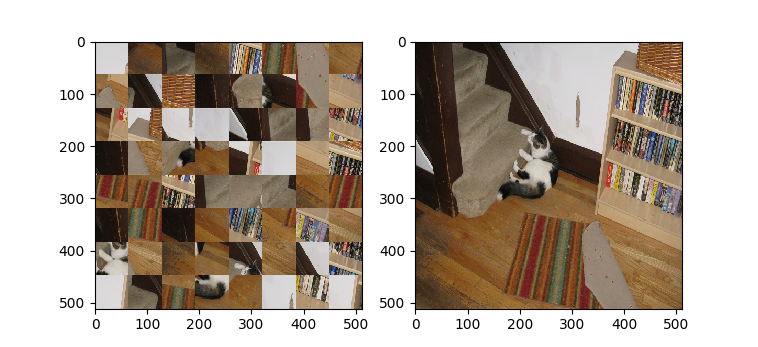

# Puzzle Unshuffler (C++, Python)



Consider a puzzle made out of a square image which has been divided into smaller squares that have been randomly shuffled.
Given such a shuffled puzzle, this solver aims to restore the original image.

Made with C++ (solver back end) and Python 3 (image handling and visualisation), for [Huawei Honorcup Marathon 2](https://codeforces.com/contest/1235/problem/A3).

## Usage

After cloning this repository and doing the necessary setup (detailed below), you may reproduce the figure above:

```sh
python3 view.py docs/images/cat.png
```

The command-line interface for the solver is `reconstruct` binary, which can be used as follows:

```sh
# 1. Solving a single image
# ./reconstruct path_to_file
./reconstruct docs/images/cat.png

# 2. Solving all images in a directory
# ./reconstruct path_to_directory
./reconstruct docs/images

# 3. Splitting a directory of images into N groups
# ./reconstruct path_to_directory group_id num_groups
num_groups=10
./reconstruct docs/images 1 $num_groups # processes only the first 1/10th of images
```

Parallelisation: The third usage (splitting into groups) is useful when running many instances of the solver in parallel with multiple cores.

## Setup

### Requirements

* Python 3.7+ and `pip`
* C++17 compiler (e.g. `gcc`)
* CMake 3.19+

### Steps

1. From the repository folder, run `cmake . && make` to build the solver.
2. Install required Python packages by running `python3 -m pip install -r requirements.txt`
